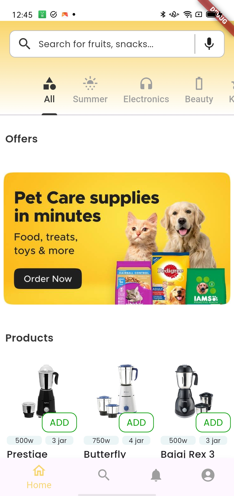
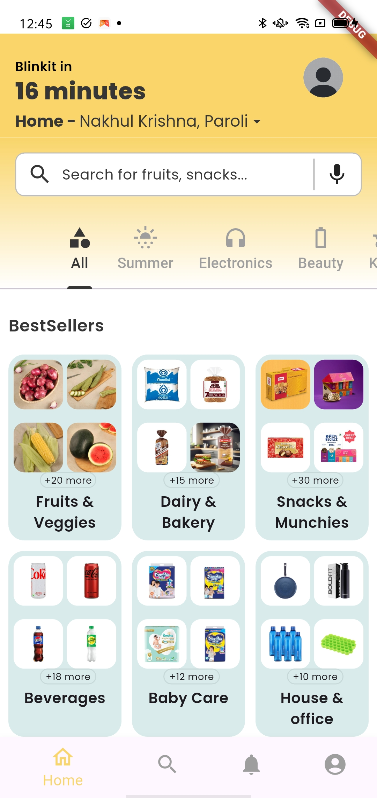
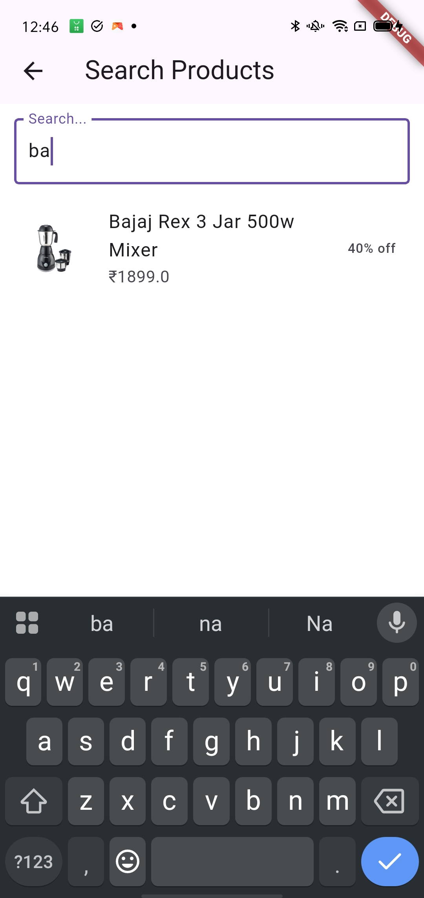

# 🛍️ Flutter Product Search App

This Flutter application is a simple yet beautifully designed **product search app** that demonstrates the use of several core Flutter features and packages including **Bloc (Cubit)** for state management, **SliverAppBar** for responsive UI, **CarouselSlider** for product image slides, and **Google Fonts** for improved typography.

---

## 📱 Features

✨ Here’s what this app can do:

- 🔍 **Search Products** — Search for products in real-time with case-insensitive matching using Bloc Cubit.
- 🧭 **SliverAppBar** — A responsive app bar that collapses and expands as you scroll.
- 🖼️ **Carousel Slider** — Scroll through product images in a beautiful horizontal carousel.
- ✍️ **Google Fonts** — Stylish and clean typography using Google Fonts.
- 🧠 **Bloc (Cubit)** — Light-weight and efficient state management.
- 📱 **Responsive Layout** — Works on multiple screen sizes and orientations.
- ✨ Shimmer Effect — Provides a smooth and dynamic loading experience when data is being fetched.

---

## 🧰 Technologies Used

| Feature            | Package                                     |
|--------------------|---------------------------------------------|
| State Management   | [flutter_bloc](https://pub.dev/packages/flutter_bloc) |
| Carousel           | [carousel_slider](https://pub.dev/packages/carousel_slider) |
| Fonts              | [google_fonts](https://pub.dev/packages/google_fonts) |
| UI Components      | Flutter + Custom Widgets                    |

---

 ## 🚀 How to Run the App

  ## Clone the Repository
   - git clone https://github.com/your-username/blinkit-clone.git
   - cd blinkit-clone

  ## Install Dependencies
   - flutter pub get
  ## Run the App
   - flutter run

   ### 🏠 Home Screen
  
   
    

  